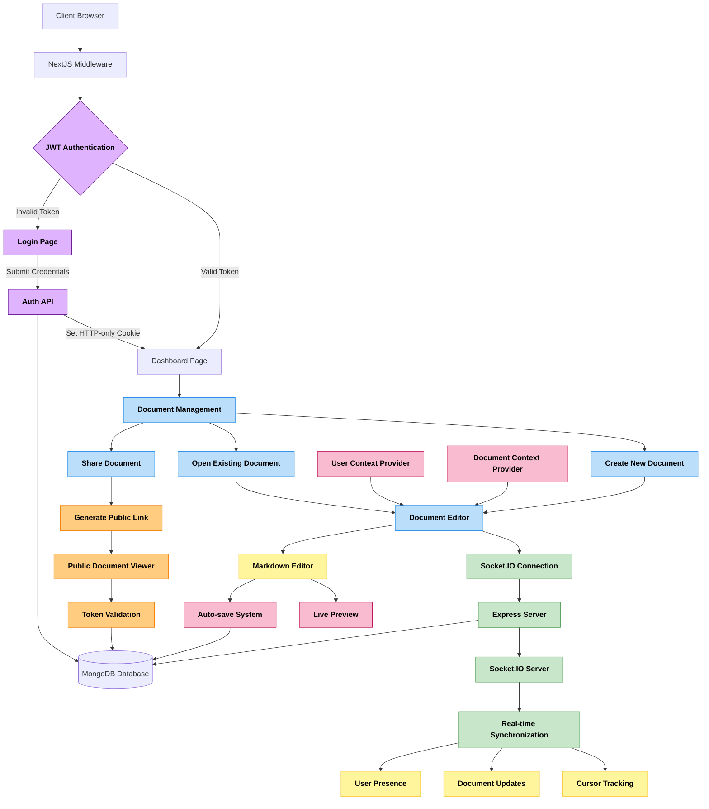

# 📝 LiveDocs - Real-Time Collaborative Document Editor

- 🌐 [**Live Deployed Website**](https://livedocs-io.vercel.app)
- 📺 [**LiveDocs Web App Demo Video**](https://youtu.be/9X43KGmAXXw)

## 📚 Table of Contents

- [Key Features](https://github.com/rakheshkrishna2005/LiveDocs?tab=readme-ov-file#-key-features)
- [Tech Stack](https://github.com/rakheshkrishna2005/LiveDocs?tab=readme-ov-file#️-tech-stack)
- [Core Modules](https://github.com/rakheshkrishna2005/LiveDocs?tab=readme-ov-file#-core-modules)
- [System Architecture](https://github.com/rakheshkrishna2005/LiveDocs?tab=readme-ov-file#️-system-architecture)
- [API Endpoints](https://github.com/rakheshkrishna2005/LiveDocs?tab=readme-ov-file#️-api-endpoints)
- [UI Snapshots](https://github.com/rakheshkrishna2005/LiveDocs?tab=readme-ov-file#-ui-snapshots)
- [Demo Video](https://github.com/rakheshkrishna2005/LiveDocs?tab=readme-ov-file#-demo-video)

## 🚀 Key Features

* 📝 **Real-Time Collaboration** — Multiple users can edit documents simultaneously with live cursor tracking
* 🔄 **Live Synchronization** — Instant document updates across all connected clients using **Socket.IO**
* 📊 **Markdown Support** — Full markdown editing with live preview functionality
* 👥 **User Management** — Secure authentication with JWT and user session management
* 🎨 **Modern UI** — Beautiful, responsive interface built with **Next.js**, **Tailwind CSS**, and **shadcn/ui**
* 💾 **Auto-Save** — Automatic document saving with manual save options
* 🔒 **Document Sharing** — Share documents with collaborators and manage permissions
* 🌐 **Public Links** — Generate secure, time-limited public links for document sharing
* 🔗 **Link Management** — Create, manage, and revoke public access tokens with expiration dates

## ⚙️ Tech Stack

| Layer      | Technologies                                               |
|------------|----------------------------------------------------------|
| 🖥️ Frontend| `Next.js 15`, `TypeScript`, `React 19`, `TailwindCSS`, `shadcn/ui` |
| 🔧 Backend | `Express.js`, `Socket.IO`, `TypeScript`                   |
| 🗄️ Database| `MongoDB`, `Mongoose`                                      |
| 🔒 Auth    | `JWT`, `HTTP-only Cookies`, `bcryptjs`                    |
| 🎨 UI/UX   | `Radix UI`, `Lucide Icons`, `React Markdown`              |
| 🔄 Real-time| `Socket.IO Client/Server`                   |

## 🧩 Core Modules

### 📝 Document Editor Engine
* Real-time markdown editing with syntax highlighting
* Live preview with custom markdown rendering
* Cursor position tracking and synchronization
* Auto-save functionality with status indicators
* Tab-based editing interface (Edit/Preview modes)

### 👥 Collaboration System
* Multi-user real-time editing
* Live cursor tracking with user identification
* User presence indicators
* Automatic conflict resolution
* Real-time user join/leave notifications

### 🔒 Authentication & Authorization
* JWT-based authentication system
* Secure HTTP-only cookie management
* Protected route middleware
* User registration and login
* Session persistence and validation

### 📊 Document Management
* Document creation, editing, and deletion
* Document sharing and collaboration
* Document ownership and permissions
* Real-time document synchronization
* MongoDB-based document storage

### 🌐 Public Sharing System
* Generate secure public access tokens
* Time-limited sharing with configurable expiration (1-30 days)
* Public view-only access without authentication
* Token-based access control with automatic expiration
* Revoke public access and disable sharing links

## 🏗️ System Architecture

## ⛓️ API Endpoints

### Authentication
- `POST /api/auth/register` - User registration
- `POST /api/auth/login` - User login
- `POST /api/auth/logout` - User logout
- `GET /api/auth/me` - Get current user

### Documents
- `GET /api/documents` - Get user documents
- `POST /api/documents` - Create new document
- `GET /api/documents/[id]` - Get specific document
- `DELETE /api/documents/[id]` - Delete document

### Document Sharing
- `GET /api/documents/[id]/share` - Get public access status
- `POST /api/documents/[id]/share` - Generate public access token
- `DELETE /api/documents/[id]/share` - Revoke public access
- `GET /api/documents/[id]/public?token=xxx` - Access public document

### Real-time Events (Socket.IO)
- `join_document` - Join document room
- `update` - Send document updates
- `save_document` - Save document to database
- `cursor_move` - Track cursor movements
- `user_joined` / `user_left` - User presence events

## 📸 UI Snapshots

## 📺 Demo Video

https://github.com/user-attachments/assets/f042c611-b99c-4480-aa1b-d88cedd1ba7e

